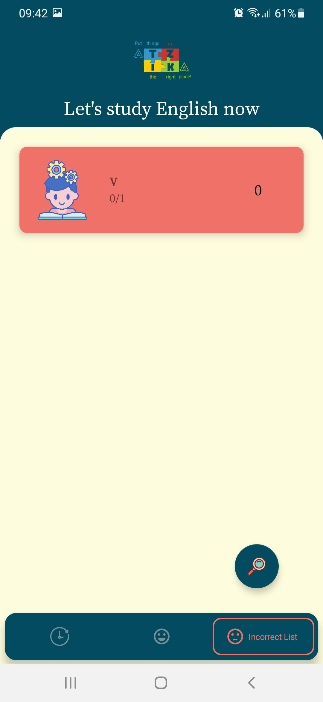

# Smart English - A Mobile app for learning english powered by ML

-----------------------------------------

## Authors:
- **Nguyễn Lê Bảo Thi** [@baothi250501](https://github.com/baothi250501)

- **Lê Công Bình** [@binhlecong](https://github.com/binhlecong)

- **Nguyễn Đăng Tiến Thành** [@tienthanh214](https://github.com/tienthanh214)

## Ideas
We use machine learning to identify surrounding objects, and provide the related vocabularies and the meaning in Vietnamese. User could also take part in quiz to test their knowledge. Our data set is quite limitted though, so this project is only suitable for the very beginner or children.

## Features
- Explore vocabulary of surrounding obejcts.
- Test learned words
- View test results and achivements

## Demo
[Watch our demo video!](https://www.youtube.com/watch?v=fzN-cu3tjeo&ab_channel=Ti%E1%BA%BFnTh%C3%A0nhNguy%E1%BB%85n%C4%90%C4%83ng)
### Start Screen

### Main Screen

### Study Screen

## Test Screen

